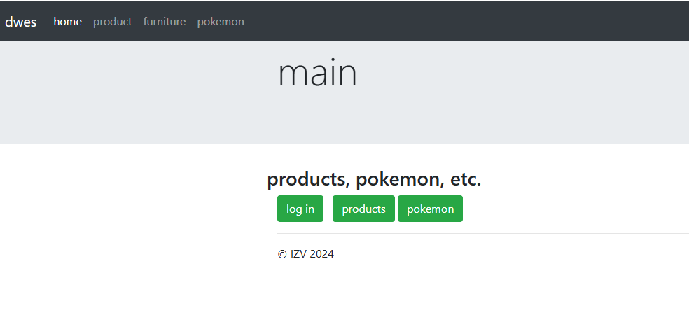
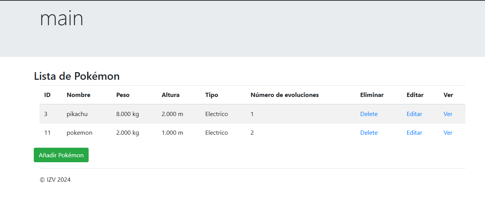
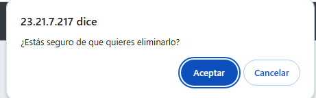
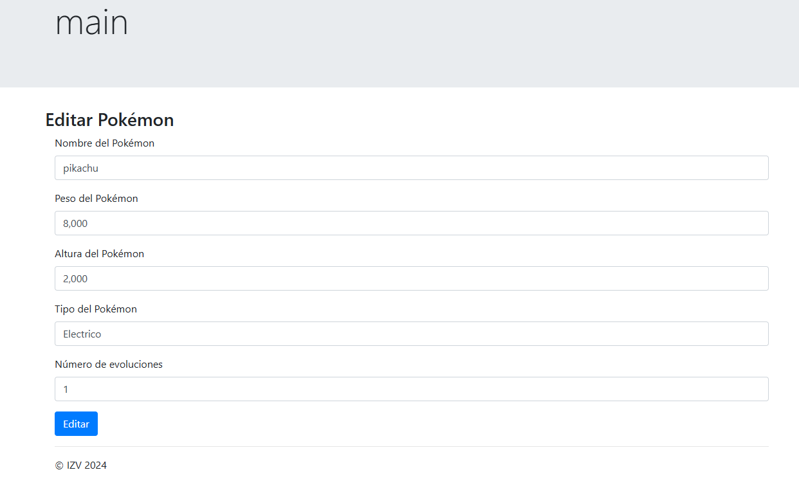

# TraditionalLaravelApp

Esta aplicación es un sistema completo de gestión de Products, Pokémon, desarrollado utilizando Laravel. Permite a los usuarios administrar y visualizar una lista de Pokémon, con la capacidad de realizar operaciones CRUD (Crear, Leer, Actualizar, Eliminar) sobre los registros de Pokémon almacenados en la base de datos.

## Menú principal

## Tabla Pokémon
Esta es la vista cuando se accede luego del log in

## Eliminar 

## Editar 

